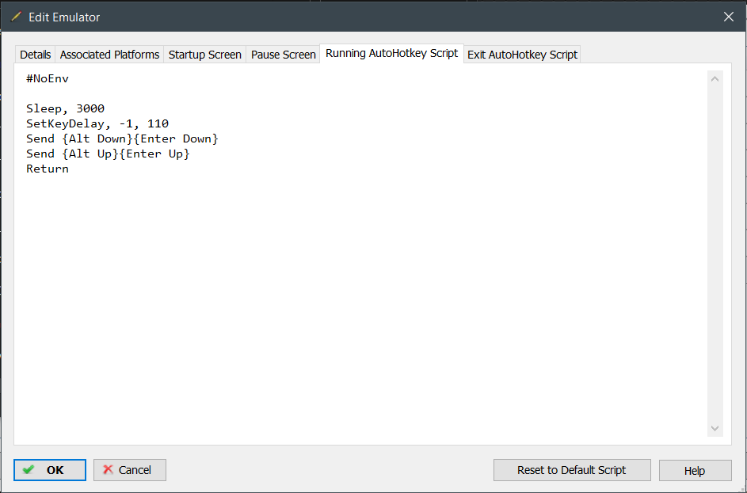

# Launch-Box_Yaba_Sanshiro_Fullscreen_AutoHotKey_Script

Made this script as the `Yana Sanshoro` emulator does not launch in fullscreen mode correctly via comandline flags. So when using this script it will autopress `Alt_Enter` when launching `Yana Sanshoro` to open in fulscreen.

## Setup

in `LaunchBox` got to `Tools > Manage Emulators` and double click on your `Yana Sanshoro` emulator and open the `Running AutoHotKey Script Tab` and paste in the contents of `launchbox_autohotkeyscript.ahk` into the window as show in the figure below.

  

